<p align="center">
  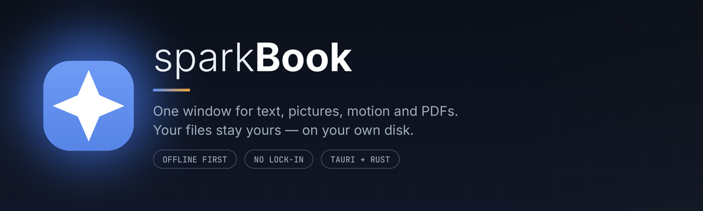
</p>

<p align="center">
  <a href="https://github.com/blackswanalpha/spark-editor/releases"></a>
  
  
  
</p>

<h3 align="center">One window for everything you write.</h3>

<p align="center">
  Notes, documents, and code live in the same place — and every one of them stays<br>
  an ordinary file on your own computer.
</p>

---

## The problem, in one sentence

You start a note. Halfway through, it needs a heading, then a list, then a snippet of code, then a
quote from a colleague — and suddenly you have three apps open, one document split across all of
them, and no idea which copy is the real one.

sparkBook is the fix. One window. One document. However you need to look at it.

<p align="center">
  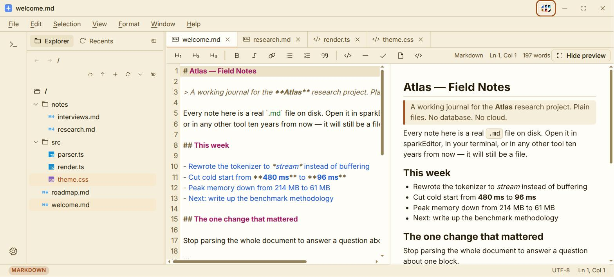
  <br><em>Write on the left. Watch the finished page take shape on the right.</em>
</p>

---

## What it feels like to use

### You type, and the page appears next to you

No preview button. No switching back and forth to check your work. The formatted page updates
beside you as you write, so the thing you are making and the thing you are looking at are never
out of step.

<p align="center">
  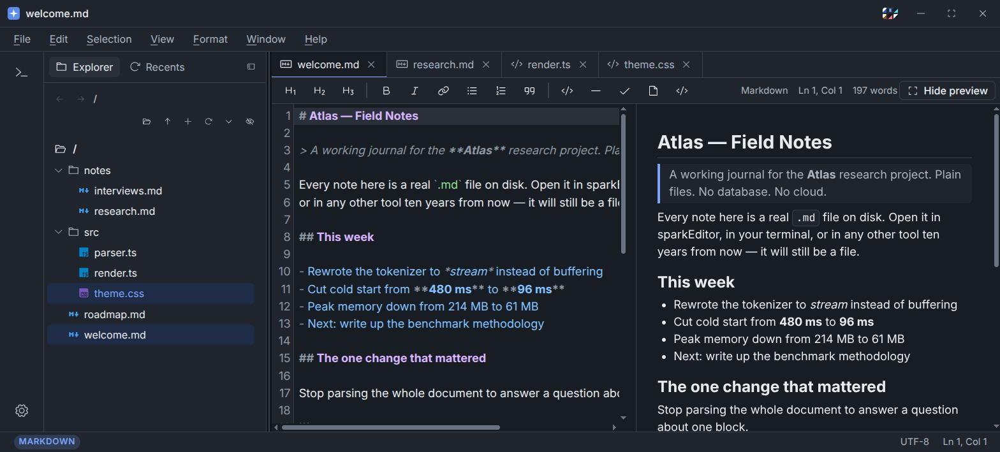
</p>

### The same file, however you prefer to work

Some days you want to see the raw text. Some days you want clean prose with a toolbar. Some days
it is code and you want line numbers and colour. sparkBook gives you nine ways to look at a
document and lets you change your mind at any moment:

| | |
|---|---|
| **Markdown** | Plain text with the page rendered beside it |
| **Rich text** | A familiar word-processor surface — bold, headings, lists, links |
| **Code** | Syntax colour and line numbers for a dozen languages |
| **HTML preview** | See a web page as a browser would, without leaving the editor |
| **SVG** | Open a vector image and work on it directly |
| **Image viewer** | Pan, zoom, rotate and inspect a photo without opening another app |
| **Image editor** | Layers, brushes, shapes, selections and adjustments — the useful half of Photoshop |
| **Animation** | A keyframe timeline over a plain-JSON scene, with a standalone HTML export |
| **PDF** | Read, search and select text in a PDF, with thumbnails and bookmarks |

### Pictures, motion and PDFs, in the same window

Drop a PNG in and it opens in the viewer; one click hands the same pixels to the editor, where
layers, a brush, a paint bucket, shapes, text and live adjustments are waiting. Save and the file
on disk changes — no export step, no second application.

The animation builder is the same idea for motion: put shapes, text or images on a stage, set
keyframes on the timeline, scrub, and export a single self-contained HTML file that plays
anywhere. The scene itself is readable JSON you can keep in version control.

PDFs open as PDFs — pages render as you scroll, the text stays selectable, and search tells you
which pages hold what you are looking for.

<p align="center">
  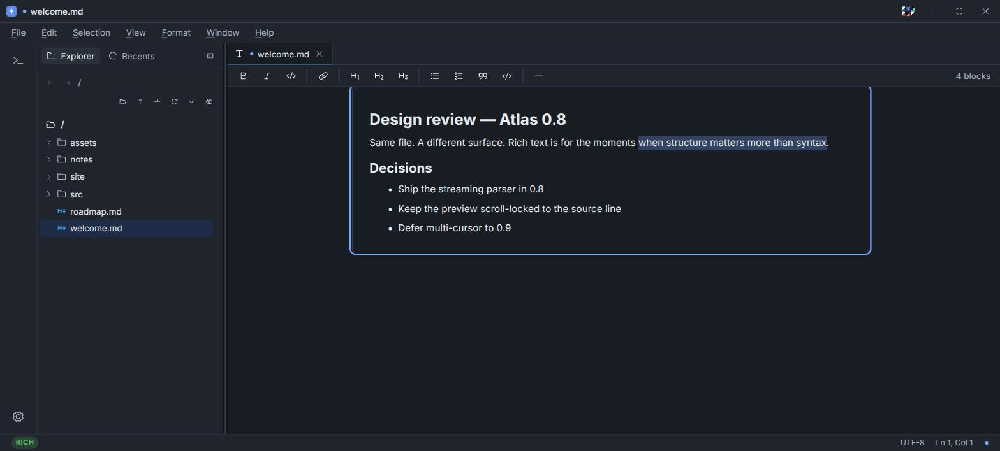
  <br><em>Rich text, for the moments when structure matters more than syntax.</em>
</p>

### Everything is one keystroke away

Press <kbd>Ctrl</kbd>+<kbd>Shift</kbd>+<kbd>P</kbd> and start typing what you want. Open a file,
change modes, split the view, jump to a line, start a terminal — the whole application answers to
a search box, so you never have to hunt through menus for something you already know the name of.

<p align="center">
  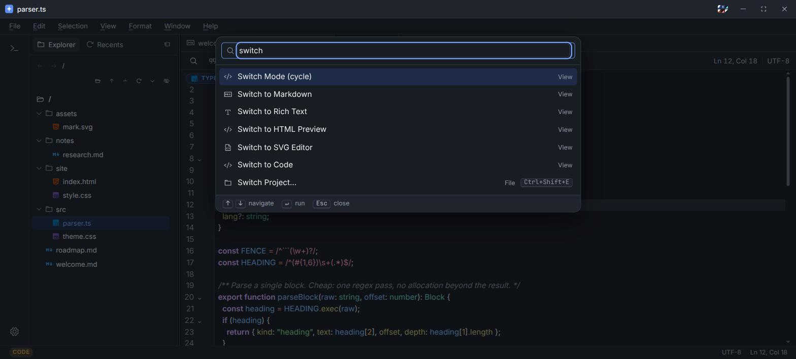
</p>

### Your project, on the left, exactly where you left it

Folders, tabs, recent files, and a working terminal at the bottom of the window. Close the app and
reopen it tomorrow — the window comes back the size you left it, with your recent files waiting.

<p align="center">
  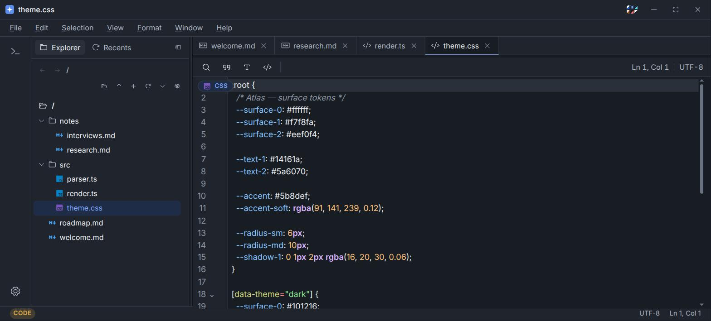
</p>

### Find anything. Change everything.

Search across the file you are in, with match highlighting, whole-word and regular-expression
options, and replace-all when you mean it.

<p align="center">
  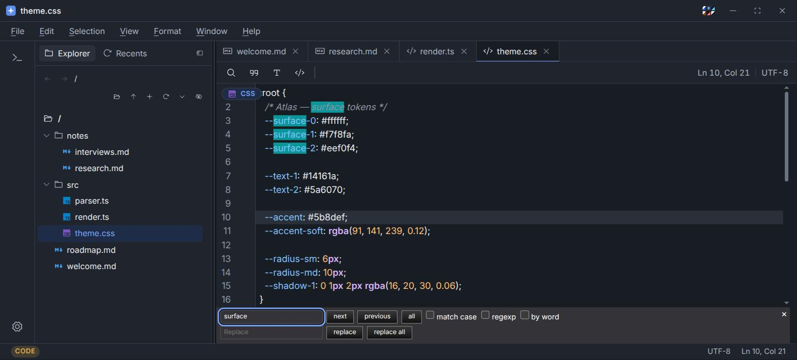
</p>

---

## Make it look like yours

Five hand-built themes — Light, Dark, Navy, Amber and Red — plus whatever your operating system
is doing right now. Change the density, change the interface size, and the editor follows.

<p align="center">
  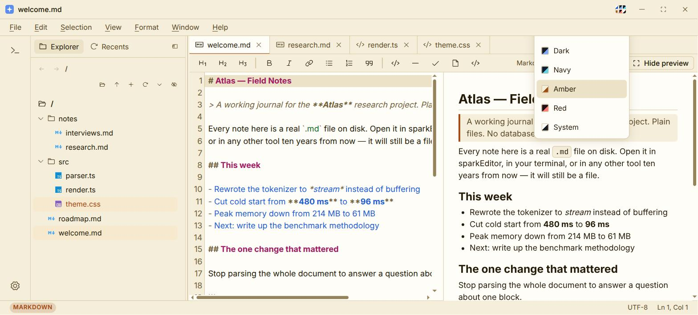
</p>

<p align="center">
  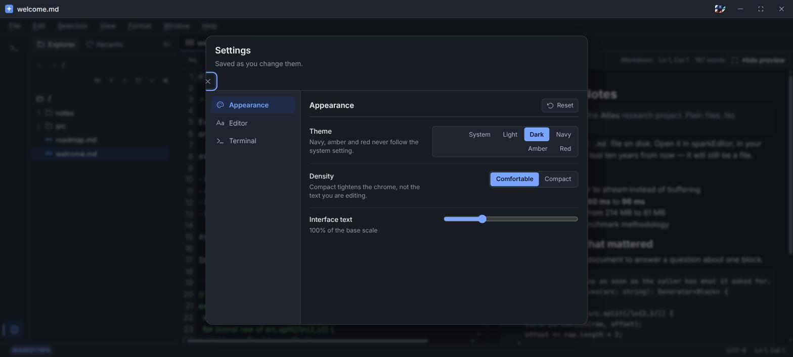
  <br><em>Settings save as you change them. There is no OK button to forget to press.</em>
</p>

<p align="center">
  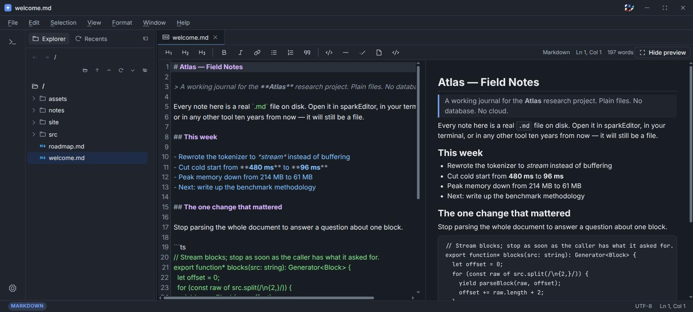
  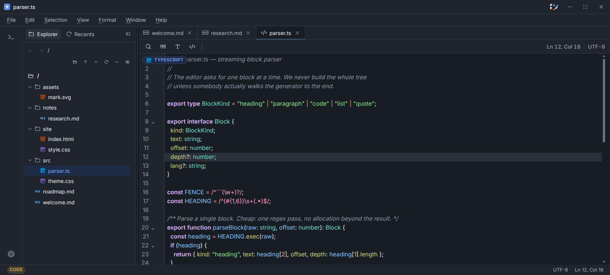
</p>

---

## What makes it different

**Your files are just files.** A document you write here is a `.md` or a `.txt` or a `.ts` sitting
in a folder you chose. Open it with anything else — another editor, a script, an app that does not
exist yet. There is no project database, no proprietary container, nothing to export from and
nothing to be locked into.

**It works with the internet off.** There is no account, no sync service and no telemetry. On a
plane, in a basement, on a train through a tunnel — it behaves identically, because none of it was
ever talking to a server.

**It is small and it starts fast.** The interface is a web front end, but the program underneath is
compiled Rust rather than a bundled browser, so the download is measured in megabytes and the
window is open before you have let go of the mouse.

**It is one window, not four.** That is the whole idea, and every decision in the product defends it.

---

## Get it

Download the installer for your platform from the
[**Releases page**](https://github.com/blackswanalpha/spark-editor/releases/latest).

| Platform | File |
|---|---|
| macOS | `.dmg` |
| Windows | `.exe` (installer) or `.msi` |
| Linux | `.AppImage`, `.deb` or `.rpm` |

Updates arrive on their own. When a new version is published the app notices it shortly after
launch, downloads and installs it in the background, and restarts into the new version. You can
also check whenever you like from **Help → Check for Updates**.

---

## Handy keys

| | |
|---|---|
| Command palette | <kbd>Ctrl</kbd>/<kbd>⌘</kbd> + <kbd>Shift</kbd> + <kbd>P</kbd> |
| New document | <kbd>Ctrl</kbd>/<kbd>⌘</kbd> + <kbd>N</kbd> |
| Open | <kbd>Ctrl</kbd>/<kbd>⌘</kbd> + <kbd>O</kbd> |
| Save | <kbd>Ctrl</kbd>/<kbd>⌘</kbd> + <kbd>S</kbd> |
| Find / replace | <kbd>Ctrl</kbd>/<kbd>⌘</kbd> + <kbd>F</kbd> / <kbd>H</kbd> |
| Show or hide the sidebar | <kbd>Ctrl</kbd>/<kbd>⌘</kbd> + <kbd>B</kbd> |
| Show or hide the terminal | <kbd>Ctrl</kbd>/<kbd>⌘</kbd> + <kbd>`</kbd> |
| Close tab | <kbd>Ctrl</kbd>/<kbd>⌘</kbd> + <kbd>W</kbd> |

---

## Building it yourself

sparkBook is a [Tauri 2](https://tauri.app) application: a React and TypeScript front end over a
small Rust host. If you want to run it from source you need Node 20+, a stable Rust toolchain, and
Tauri's [system prerequisites](https://tauri.app/start/prerequisites/).

```bash
npm install
npm run tauri dev     # the real desktop app, with hot reload
npm run tauri build   # an installer for your platform
```

The front end also runs on its own in a browser, backed by an in-memory filesystem, which is handy
for working on the interface without a Rust toolchain:

```bash
npm run dev           # http://localhost:1420
```

Before opening a pull request, run `npm run ci` — version check, types, lint, tests and a
production build.

## Reading further

| | |
|---|---|
| [`explanation.md`](explanation.md) | Why the editor is built the way it is |
| [`changelog/`](changelog/) | Every release, and what changed in it |
| [`worklog.md`](worklog.md) | The build log, in order |
| [`gitflow.md`](gitflow.md) | How branches and releases are cut |

## License

MIT. Type Inter and JetBrains Mono are used under the SIL Open Font License 1.1.
